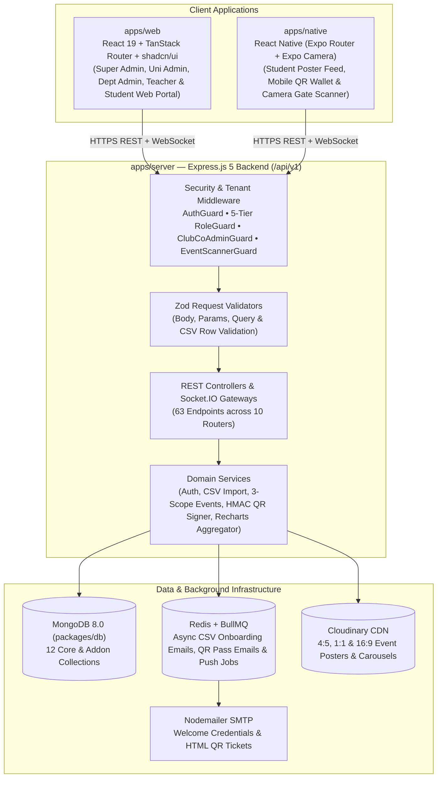
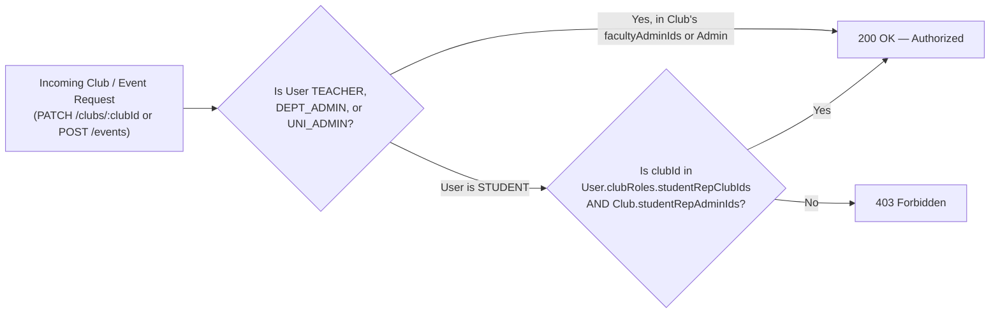
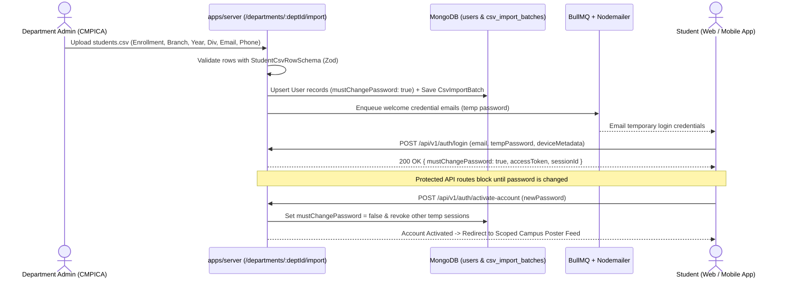
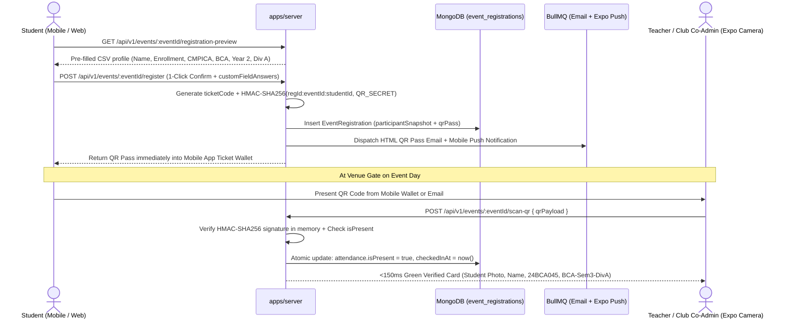

# UniSphere — System Architecture & Engineering Blueprint

  

---

## 1. Architectural Philosophy

UniSphere is designed around **two simultaneous goals**:
1. **Production-Grade Multi-University Scale**: Strict multi-tenant isolation (`universityId`, `departmentId`), closed-loop CSV identity provisioning, sub-150ms cryptographic QR gate scanning, real-time Socket.IO counters, and Instagram-style media feeds.
2. **Beginner-Friendly Engineering Clarity**: Because UniSphere is built by **~30 student developers across 3 teams** in the **CHARUSAT Development Club**, every package and service follows an explicit, predictable pattern (`routes -> validators -> controllers -> services`) with zero hidden magic.

---

## 2. High-Level System Architecture

---

## 3. Monorepo Package Ownership Matrix

| Workspace Path | Package Name | Primary Owner | Responsibility |
| :--- | :--- | :--- | :--- |
| `apps/server` | `@UniSphere_cor/server` | Team 1 (Core) + Team 2/3 Routers | Express 5 REST API (`/api/v1/*`), Socket.IO live attendance server, BullMQ workers, Nodemailer, OpenTelemetry. |
| `apps/web` | `@UniSphere_cor/web` | Team 1, Team 2, Team 3 | Role-based Web Dashboards (Global Super Dashboard, University Admin, Dept CSV Importer, Teacher/Club Studio, Student Feed, Recharts + SheetJS Exports). |
| `apps/native` | `@UniSphere_cor/native` | Team 1 (Mobile Sub-team) | React Native (Expo) app featuring Instagram Poster Feed, 1-Click Autofill Registration, Offline-Ready QR Ticket Wallet, and Camera QR Gate Scanner. |
| `packages/db` | `@UniSphere_cor/db` | Team 1 Leads | Locked 12-collection Prisma/MongoDB schema (`packages/db/prisma/schema.prisma`) and database client singleton. |
| `packages/env` | `@UniSphere_cor/env` | Team 1 Leads | Zod-validated environment configuration (`server`, `web`, `native`). |
| `packages/config` | `@UniSphere_cor/config` | Team 1 Leads | Shared TypeScript compiler configurations across workspaces. |

---

## 4. Five-Tier Multi-University RBAC & Dual Club Co-Leadership

UniSphere enforces a 5-tier institutional role hierarchy plus delegated **Student Representative Club Co-Admin** authority:

### 4.1 Role Hierarchy
1. **`SUPER_ADMIN` (Tier 1 — Dev Club Managers)**:
   - Onboards new Universities (`CHARUSAT`, etc.) and assigns **multiple Main University Admins** (`University.adminIds[]`).
   - Views cross-university KPIs and tenant growth charts on the **Global Super Dashboard**.
2. **`UNIVERSITY_ADMIN` (Tier 2 — Multiple per University)**:
   - Manages university-wide settings, creates academic Departments (`CMPICA`, `CSPIT`, `DEPSTAR`), and assigns **multiple Department Admins** (`Department.adminIds[]`).
   - Publishes university-wide (`UNIVERSITY` scope) events and monitors university analytics.
3. **`DEPARTMENT_ADMIN` (Tier 3 — Multiple per Department, e.g., CMPICA)**:
   - Configures department academic branches (`BCA`, `MCA`, `B.Sc(IT)`, `M.Sc(IT)`) and batch years (`1..4`).
   - Executes **Closed-Loop CSV Bulk Onboarding** for **Teachers** and **Students** (`POST /api/v1/departments/:deptId/import/teachers-csv` and `students-csv`).
4. **`TEACHER` (Tier 4 — Faculty)**:
   - Creates events across all 3 scopes (`CLASS`, `DEPARTMENT`, `UNIVERSITY`).
   - Creates Campus Clubs (e.g., *Garba Club*, *Drawing Club*), serves as **Faculty Club Admin** (`Club.facultyAdminIds[]`), promotes students to **Student Representative Co-Admins**, scans QR tickets at event gates, and exports `.csv`/`.xlsx` attendance sheets.
5. **`STUDENT` & `STUDENT_REP_ADMIN` (Tier 5 — Students & Club Co-Leaders)**:
   - Logs in with CSV-provisioned credentials, activates account on first login, browses the Instagram-style campus poster feed, registers in 1 click using **autofilled profile fields**, and receives QR tickets on both **Mobile App Wallet + Email**.
   - When promoted to `Club.studentRepAdminIds[]` (`User.clubRoles.studentRepClubIds[]`), passes the **`ClubCoAdminGuard`** alongside the Teacher Admin to approve club members, upload posters, and manage club events.

### 4.2 `ClubCoAdminGuard` Resolution Logic

---

## 5. Closed-Loop CSV Onboarding & Mandatory Account Activation

Direct public self-registration is disabled for Teachers and Students so that every student's `enrollmentNo`, `branch`, `batchYear`, `semester`, and `classDivision` is 100% institutionally verified.

---

## 6. Three-Scope Event Visibility & Eligibility Engine

Every `Event` and `FeedPost` contains a `scopeConfig` sub-document that controls both **who sees the event in their feed** and **who is permitted to register**:

| `scopeConfig.scopeLevel` | Target Audience | Eligibility Rule Verified by Backend |
| :--- | :--- | :--- |
| **`CLASS`** | Specific class division(s) inside a department (e.g., `CMPICA -> BCA -> Year 2 -> BCA-Sem3-DivA`) | `user.universityId == event.universityId` AND `user.departmentId in targetDepartmentIds` AND `user.studentProfile.branch in targetBranches` AND `user.studentProfile.batchYear in targetBatchYears` AND `user.studentProfile.classDivision in targetClassDivisions` |
| **`DEPARTMENT`** | Entire department or specific branches/years within a department (e.g., all `CMPICA` students, or `CMPICA MCA Year 1 & 2`) | `user.universityId == event.universityId` AND `user.departmentId in targetDepartmentIds` (plus optional `targetBranches` / `targetBatchYears` filters if non-empty) |
| **`UNIVERSITY`** | All students and faculty across all departments in the university (e.g., Annual `CHARUSAT` Spoural / Tech Fest) | `user.universityId == event.universityId` |

---

## 7. Multi-Device `UserSession` Architecture

Students and Teachers regularly use **UniSphere Web** (on a college lab desktop or laptop) and **UniSphere Mobile** (on Android/iOS) at the same time. Instead of a single-token overwrite model:

- Every `POST /api/v1/auth/login` creates a dedicated document in `user_sessions` (`UserSession`) with a unique `sessionId`, `deviceMetadata` (`deviceId`, `deviceName`, `platform: 'WEB' | 'ANDROID' | 'IOS'`, `ipAddress`, `userAgent`, `expoPushToken`), and a SHA-256 `refreshTokenHash`.
- Access JWTs carry `{ sub: userId, sessionId, role, universityId, departmentId }`.
- Users can inspect all active devices via `GET /api/v1/auth/sessions` and remotely sign out a forgotten lab PC (`DELETE /api/v1/auth/sessions/:sessionId`) or sign out all other devices (`POST /api/v1/auth/logout-other-devices`) without interrupting their phone session.

---

## 8. 1-Click Autofill Registration, Dual QR Pass & `<150ms` Gate Scanning

