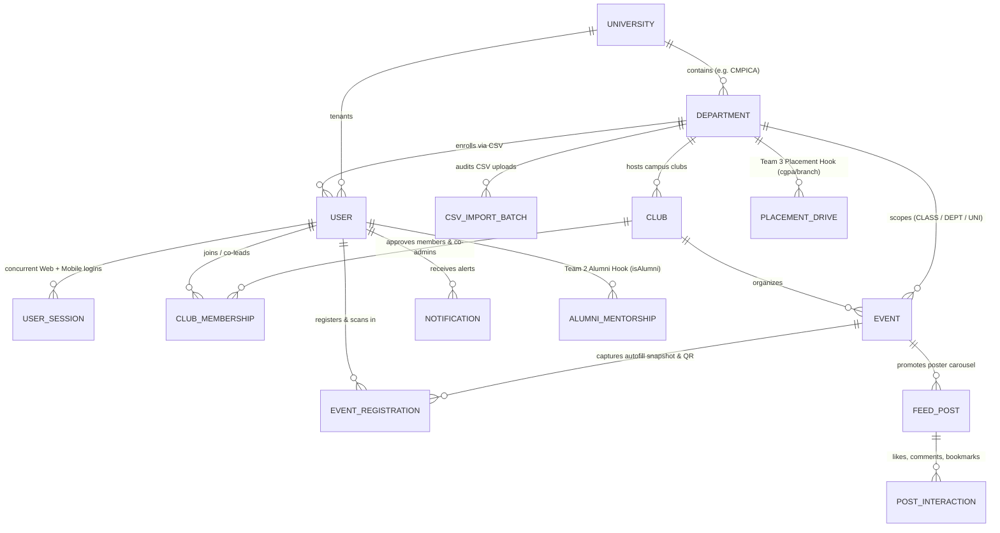

# UniSphere — Database Architecture & 12-Collection Schema Specification (`packages/db`)

  

---

## 1. Database Overview

UniSphere uses **MongoDB 8.0** (`packages/db/docker-compose.yml`) with **Prisma ORM** (`packages/db/prisma/schema.prisma`) across **12 collections** organized into 4 architectural layers:

| Layer | Collections | Primary Owner |
| :--- | :--- | :--- |
| **Layer 1: Tenant Governance, Identity & Multi-Device Sessions** | `1. universities`, `2. departments`, `3. users`, `4. user_sessions`, `5. csv_import_batches` | Team 1 (Core Platform) |
| **Layer 2: Campus Clubs & Dual Co-Leadership** | `6. clubs`, `7. club_memberships` | Team 1 (Core Platform) |
| **Layer 3: 3-Scope Events, Autofill QR Passes & Gate Attendance** | `8. events`, `9. event_registrations` | Team 1 (Core Platform) |
| **Layer 4: Instagram Poster Feed, Notifications & Team 2/3 Addons** | `10. feed_posts`, `11. post_interactions` & `notifications`, `12. alumni_mentorships` (Team 2) & `placement_drives` (Team 3) | Team 1 + Team 2 + Team 3 |

---

## 2. Multi-Tenant Entity-Relationship (ER) Diagram

---

## 3. Collection-by-Collection Field & Index Specification

### Collection 1: `universities` (`University` Model)
Root tenant entity managed by `SUPER_ADMIN` (Development Club Platform Managers).

| Field | Type | Constraints / Default | Description |
| :--- | :--- | :--- | :--- |
| `_id` | `ObjectId` | Primary Key (`@id @default(auto())`) | Unique University ID |
| `name` | `String` | Required | Full name, e.g., `"Charotar University of Science and Technology"` |
| `shortName` | `String` | Required | Short display name, e.g., `"CHARUSAT"` |
| `code` | `String` | `@unique`, Uppercase | Tenant code, e.g., `"CHARUSAT"` |
| `domain` | `String` | Required | Institutional email domain, e.g., `"charusat.edu.in"` |
| `logoUrl` | `String?` | Optional | Banner/crest logo URL |
| `location` | `UniversityLocation` | Embedded `{ city, state, country }` | Campus geographic metadata |
| `adminIds` | `ObjectId[]` | Default `[]` | Array of `User._id` holding `UNIVERSITY_ADMIN` authority (multiple allowed) |
| `isActive` | `Boolean` | Default `true` | Tenant active toggle |
| `createdBy` | `ObjectId` | Ref -> `User` (`SUPER_ADMIN`) | Super Admin who onboarded the university |
| `createdAt` / `updatedAt` | `DateTime` | Auto timestamps | Creation and modification timestamps |

- **Indexes**: `{ code: 1 } (unique)`, `{ isActive: 1 }`.

---

### Collection 2: `departments` (`Department` Model)
Academic institute or department inside a university (e.g., **CMPICA**, **CSPIT**, **DEPSTAR**) managed by `UNIVERSITY_ADMIN` and `DEPARTMENT_ADMIN`.

| Field | Type | Constraints / Default | Description |
| :--- | :--- | :--- | :--- |
| `_id` | `ObjectId` | Primary Key | Unique Department ID |
| `universityId` | `ObjectId` | Ref -> `University`, Required | Parent university tenant |
| `name` | `String` | Required | Full name, e.g., `"Smt. Chandaben Mohanbhai Patel Institute of Computer Applications"` |
| `code` | `String` | Required, Uppercase | Department code, e.g., `"CMPICA"` |
| `logoUrl` | `String?` | Optional | Department crest URL |
| `branches` | `String[]` | Default `["BCA", "MCA", "B.Sc(IT)", "M.Sc(IT)"]` | Valid academic branches for CSV validation & event scoping |
| `availableYears` | `Int[]` | Default `[1, 2, 3, 4]` | Valid batch years for this department |
| `adminIds` | `ObjectId[]` | Default `[]` | Array of `User._id` with `DEPARTMENT_ADMIN` authority (multiple allowed) |
| `isActive` | `Boolean` | Default `true` | Department status |
| `createdBy` | `ObjectId` | Ref -> `User` | University Admin who created the department |
| `createdAt` / `updatedAt` | `DateTime` | Auto timestamps | Audit timestamps |

- **Indexes**: `{ universityId: 1, code: 1 } (unique)`, `{ universityId: 1, isActive: 1 }`.

---

### Collection 3: `users` (`User` Model — Closed-Loop CSV Provisioned)
Unified identity collection across all 5 tiers. Public signup is disabled; Teachers and Students are provisioned via Department Admin CSV upload with `mustChangePassword: true`.

| Field | Type | Constraints / Default | Description |
| :--- | :--- | :--- | :--- |
| `_id` | `ObjectId` | Primary Key | Unique User ID |
| `universityId` | `ObjectId?` | Ref -> `University` (`null` only for `SUPER_ADMIN`) | University tenant scope |
| `departmentId` | `ObjectId?` | Ref -> `Department` | Home department (e.g., `CMPICA`) |
| `role` | `UserRole` | `SUPER_ADMIN \| UNIVERSITY_ADMIN \| DEPARTMENT_ADMIN \| TEACHER \| STUDENT` | Primary 5-tier RBAC role |
| `name` | `String` | Required | Full official name (used in event autofill) |
| `email` | `String` | `@unique`, Lowercase | Institutional email address |
| `phone` | `String` | Required | Mobile number (used in event autofill) |
| `avatarUrl` | `String?` | Optional | Profile image URL |
| `passwordHash` | `String` | Required (Argon2 / bcrypt) | Hashed password |
| `mustChangePassword` | `Boolean` | Default `true` for CSV imports | Forces password change on first login (`POST /api/v1/auth/activate-account`) |
| `isActive` | `Boolean` | Default `true` | Account status |
| `studentProfile` | `StudentProfile?` | Embedded Composite Type | Populated for `STUDENT`: `{ enrollmentNo: "24BCA045", branch: "BCA", batchYear: 2, semester: 3, classDivision: "BCA-Sem3-DivA", cgpa?: 8.6, skills?: string[], resumeUrl?: string, isAlumni: false, graduationYear?: number, currentCompany?: string }` |
| `teacherProfile` | `TeacherProfile?` | Embedded Composite Type | Populated for `TEACHER`: `{ employeeId: "EMP-CMP-104", designation: "Assistant Professor", cabinNo?: "C-204" }` |
| `clubRoles` | `UserClubRoles` | Embedded Composite Type | `{ facultyAdminClubIds: ObjectId[], studentRepClubIds: ObjectId[] }` — powers `ClubCoAdminGuard` |
| `audienceMemberships` | `String[]` | Default `[]` | Pre-computed 3-scope audience tags stamped at CSV import. Format: `'{universityCode}:{deptCode}:{branch}:{batchYear}:{classDivision}'`. A student in BCA Sem3 DivA gets `["CHARUSAT:CMPICA:BCA:2:BCA-Sem3-DivA", "CHARUSAT:CMPICA:*", "CHARUSAT:*"]`. Enables O(1) `hasSome` array-intersection feed and event queries — no `$or` fan-out. |
| `importBatchId` | `ObjectId?` | Ref -> `CsvImportBatch` | CSV batch that provisioned or last updated this user |
| `provisionedBy` | `ObjectId?` | Ref -> `User` | Admin who imported/created the account |
| `lastLoginAt` | `DateTime?` | Optional | Timestamp of latest login |
| `createdAt` / `updatedAt` | `DateTime` | Auto timestamps | Audit timestamps |

- **Indexes**:
  - `{ email: 1 } (unique)`
  - `{ universityId: 1, "studentProfile.enrollmentNo": 1 } (unique, sparse, partialFilterExpression: { role: "STUDENT" })` — created via `bun run db:indexes` (`packages/db/src/setup-indexes.ts`) since Prisma MongoDB cannot express partial unique indexes in schema DSL.
  - `{ departmentId: 1, role: 1, "studentProfile.branch": 1, "studentProfile.batchYear": 1, "studentProfile.classDivision": 1 }`

---

### Collection 4: `user_sessions` (`UserSession` Model — Multi-Device Login & Remote Sign-Out)
Tracks concurrent device sessions so a user can stay logged in on Web and Mobile simultaneously, receive push notifications on all mobile devices, and remotely revoke any session.

| Field | Type | Constraints / Default | Description |
| :--- | :--- | :--- | :--- |
| `_id` | `ObjectId` | Primary Key (`sessionId` in JWT) | Unique per-device session identifier |
| `userId` | `ObjectId` | Ref -> `User`, Indexed | Owner of the session |
| `universityId` | `ObjectId?` | Ref -> `University` | Tenant scope |
| `refreshTokenHash` | `String` | `@unique` (SHA-256) | Rotated on every `POST /api/v1/auth/refresh` |
| `deviceMetadata` | `DeviceMetadata` | Embedded Composite Type | `{ deviceId: string, deviceName: string, platform: 'WEB' \| 'ANDROID' \| 'IOS', ipAddress: string, userAgent: string, expoPushToken?: string }` |
| `lastActiveAt` | `DateTime` | Default `now()` | Updated on token refresh / active session use |
| `expiresAt` | `DateTime` | TTL Index (`expireAfterSeconds: 0`) | Automatic MongoDB expiration timestamp |
| `isRevoked` | `Boolean` | Default `false` | True if logged out or remotely revoked |
| `revokedAt` | `DateTime?` | Optional | When session was revoked |
| `revokedReason` | `RevokeReason?` | `'USER_LOGOUT' \| 'REMOTE_REVOKE' \| 'PASSWORD_RESET' \| 'ADMIN_SUSPEND'` | Audit reason for revocation |

- **Indexes**:
  - `{ userId: 1, isRevoked: 1, lastActiveAt: -1 }`
  - `{ refreshTokenHash: 1 } (unique)`
  - `{ expiresAt: 1 } (expireAfterSeconds: 0)`

---

### Collection 5: `csv_import_batches` (`CsvImportBatch` Model)
Audit log and row-level error report for every Teacher and Student CSV upload run by a `DEPARTMENT_ADMIN`.

| Field | Type | Constraints / Default | Description |
| :--- | :--- | :--- | :--- |
| `_id` | `ObjectId` | Primary Key | Unique Import Batch ID |
| `universityId` | `ObjectId` | Ref -> `University` | University scope |
| `departmentId` | `ObjectId` | Ref -> `Department` | Department scope (e.g., `CMPICA`) |
| `uploadedBy` | `ObjectId` | Ref -> `User` (`DEPARTMENT_ADMIN`) | Admin who uploaded the CSV |
| `importType` | `CsvImportType` | `'TEACHER_ROSTER' \| 'STUDENT_ROSTER'` | Type of CSV import |
| `fileName` | `String` | Required | Original uploaded file name |
| `summary` | `ImportSummary` | Embedded `{ totalRows, createdCount, updatedCount, failedCount }` | Row processing counters |
| `rowErrors` | `CsvRowError[]` | Array of `{ rowNumber, rawIdentifier, errorMessages[] }` | Line-by-line Zod validation errors |
| `status` | `ImportStatus` | `'PROCESSING' \| 'COMPLETED' \| 'COMPLETED_WITH_ERRORS' \| 'FAILED'` | Job execution state |
| `createdAt` / `completedAt` | `DateTime` | Timestamps | Start and completion times |

---

### Collection 6: `clubs` (`Club` Model — Dual Faculty + Student Co-Leadership)
Campus clubs (e.g., **Garba Club**, **Drawing Club**, **CHARUSAT Dev Club**) supporting joint management by Faculty Teacher Admins and Student Representative Co-Admins.

| Field | Type | Constraints / Default | Description |
| :--- | :--- | :--- | :--- |
| `_id` | `ObjectId` | Primary Key | Unique Club ID |
| `universityId` | `ObjectId` | Ref -> `University` | University tenant |
| `departmentId` | `ObjectId?` | Ref -> `Department` (`null` if university-wide) | Owning department (e.g., `CMPICA`) |
| `name` | `String` | Required | Display name, e.g., `"CMPICA Garba Club"` |
| `slug` | `String` | Required | URL-safe slug, e.g., `"cmpica-garba-club"` |
| `category` | `ClubCategory` | `'CULTURAL' \| 'ARTS' \| 'TECHNICAL' \| 'SPORTS' \| 'LITERARY' \| 'SOCIAL'` | Club domain category |
| `description` | `String` | Required | Mission, activities, and joining criteria |
| `logoUrl` / `bannerUrl` | `String?` | Optional | Cloudinary branding images |
| `facultyAdminIds` | `ObjectId[]` | Ref -> `User` (`TEACHER`) | Faculty Teacher Admins of the club |
| `studentRepAdminIds` | `ObjectId[]` | Ref -> `User` (`STUDENT`) | Student Representative Co-Admins (`ClubCoAdminGuard`) |
| `memberCount` | `Int` | Default `0` | Approved student members count |
| `isAcceptingApplications` | `Boolean` | Default `true` | Controls whether students can apply |
| `isActive` | `Boolean` | Default `true` | Active status |
| `createdBy` | `ObjectId` | Ref -> `User` | Creator ID |
| `createdAt` / `updatedAt` | `DateTime` | Auto timestamps | Audit timestamps |

- **Indexes**: `{ universityId: 1, slug: 1 } (unique)`, `{ universityId: 1, departmentId: 1, category: 1 }`.

> **ClubCoAdminGuard — Single Source of Truth**: `Club.facultyAdminIds[]` and `Club.studentRepAdminIds[]` are the **only** authority for club co-admin authorization. The previously planned `User.clubRoles` embedded array has been removed to eliminate dual-write desync. The guard performs a targeted `clubs` collection lookup (`SELECT facultyAdminIds, studentRepAdminIds WHERE _id = clubId`) cached in Redis at `club:co-admins:{clubId}` with a 60-second TTL for hot-path efficiency.

---

### Collection 7: `club_memberships` (`ClubMembership` Model)
Tracks student applications to join campus clubs and their assigned role inside the club.

| Field | Type | Constraints / Default | Description |
| :--- | :--- | :--- | :--- |
| `_id` | `ObjectId` | Primary Key | Unique Membership ID |
| `clubId` | `ObjectId` | Ref -> `Club` | Target club |
| `universityId` | `ObjectId` | Ref -> `University` | University tenant |
| `departmentId` | `ObjectId` | Ref -> `Department` | Student's department |
| `studentId` | `ObjectId` | Ref -> `User` (`STUDENT`) | Student member/applicant |
| `memberRole` | `ClubMemberRole` | `'MEMBER' \| 'CORE_COMMITTEE' \| 'STUDENT_REP_ADMIN'` | Club-internal tier |
| `applicationReason` | `String?` | Optional | Why the student wants to join |
| `portfolioLink` | `String?` | Optional | GitHub / Behance / portfolio link |
| `status` | `MembershipStatus` | `'PENDING' \| 'APPROVED' \| 'REJECTED' \| 'LEFT'` | Approval state |
| `reviewedBy` | `ObjectId?` | Ref -> `User` | Teacher Admin or Student Rep Co-Admin who reviewed |
| `reviewedAt` / `joinedAt` | `DateTime?` | Optional | Approval timestamps |

- **Indexes**: `{ clubId: 1, studentId: 1 } (unique)`, `{ clubId: 1, status: 1 }`.

---

### Collection 8: `events` (`Event` Model — 3-Scope Engine & Poster Carousel)
Core event entity supporting `CLASS`, `DEPARTMENT`, and `UNIVERSITY` scopes, swipeable poster carousels, and autofill registration schemas.

| Field | Type | Constraints / Default | Description |
| :--- | :--- | :--- | :--- |
| `_id` | `ObjectId` | Primary Key | Unique Event ID |
| `universityId` | `ObjectId` | Ref -> `University` | University tenant |
| `departmentId` | `ObjectId?` | Ref -> `Department` | Organizing department (`null` if university-wide) |
| `clubId` | `ObjectId?` | Ref -> `Club` | Organizing club (`null` if academic/faculty event) |
| `title` | `String` | Required | Event title |
| `slug` | `String` | Required | URL-safe slug |
| `shortCaption` | `String` | Max 280 chars | Instagram-style preview caption with `#hashtags` |
| `description` | `String` | Required | Full description, rules, schedule, prizes |
| `category` | `EventCategory` | `'WORKSHOP' \| 'SEMINAR' \| 'CULTURAL' \| 'COMPETITION' \| 'FEST' \| 'CLASS_ACTIVITY'` | Event classification |
| `posterAndMedia` | `EventMedia` | Embedded `{ posterUrl: string, galleryImages: [{ url, publicId, aspectRatio: '4:5'\|'1:1'\|'16:9', caption? }] }` | High-res primary poster + up to 10 carousel slides |
| `scopeConfig` | `EventScopeConfig` | Embedded `{ scopeLevel: 'CLASS' \| 'DEPARTMENT' \| 'UNIVERSITY', targetDepartmentIds: ObjectId[], targetBranches: string[], targetBatchYears: number[], targetClassDivisions: string[] }` | 3-Tier visibility and registration eligibility engine |
| `resolvedAudienceTags` | `String[]` | Default `[]` | Pre-computed audience tags resolved from `scopeConfig` at event creation time. Used for feed and event list queries via `hasSome` against `User.audienceMemberships`. Format mirrors user tags: `"CHARUSAT:CMPICA:BCA:2:BCA-Sem3-DivA"` / `"CHARUSAT:CMPICA:*"` / `"CHARUSAT:*"`. |
| `venue` | `String` | Required | Physical auditorium/lab/ground or online URL |
| `startTime` / `endTime` | `DateTime` | Required | Event start and end timestamps |
| `registrationDeadline` | `DateTime` | Required | Cutoff for student 1-click registration |
| `maxCapacity` | `Int?` | `null` = unlimited | Seat cap |
| `formConfig` | `EventFormConfig` | Embedded `{ autofillFields: string[], customFields: [{ key, label, type: 'TEXT'\|'SELECT'\|'BOOLEAN'\|'URL', options?, required }] }` | Defines which CSV profile fields auto-populate + optional custom questions |
| `authorizedScannerIds` | `ObjectId[]` | Ref -> `User` | Faculty + Club Co-Admins + Volunteers allowed to scan QR codes at the gate |
| `registeredCount` / `attendedCount` | `Int` | Default `0` | Live atomic registration and gate scan counters |
| `likesCount` / `bookmarksCount` | `Int` | Default `0` | Engagement counters |
| `status` | `EventStatus` | `'DRAFT' \| 'PUBLISHED' \| 'ONGOING' \| 'COMPLETED' \| 'CANCELLED'` | Lifecycle state |
| `createdBy` | `ObjectId` | Ref -> `User` | Organizer ID |
| `createdAt` / `updatedAt` | `DateTime` | Auto timestamps | Audit timestamps |

- **Indexes**:
  - `{ universityId: 1, status: 1, "scopeConfig.scopeLevel": 1, startTime: 1 }`
  - `{ departmentId: 1, "scopeConfig.targetBranches": 1, "scopeConfig.targetClassDivisions": 1 }`
  - `{ clubId: 1, startTime: -1 }`

---

### Collection 9: `event_registrations` (`EventRegistration` Model — Denormalized Autofill Snapshot, Dual QR & Gate Check-In)
Stores each student's event registration, a frozen `participantSnapshot` from their verified CSV profile (enabling zero-join Recharts analytics and instant CSV/Excel exports), their HMAC-SHA256 QR pass, and gate check-in telemetry.

| Field | Type | Constraints / Default | Description |
| :--- | :--- | :--- | :--- |
| `_id` | `ObjectId` | Primary Key | Unique Registration ID |
| `eventId` | `ObjectId` | Ref -> `Event` | Target event |
| `universityId` / `departmentId` | `ObjectId` | Tenant & department IDs | Multi-tenant partition keys |
| `studentId` | `ObjectId` | Ref -> `User` (`STUDENT`) | Registered student |
| `participantSnapshot` | `ParticipantSnapshot` | Embedded `{ name, email, phone, enrollmentNo, departmentCode, branch, batchYear, classDivision }` | Denormalized from `User` at registration time |
| `customFieldAnswers` | `Json` | Default `{}` | Student answers to `event.formConfig.customFields` |
| `qrPass` | `QrPass` | Embedded `{ ticketCode: string, qrSignature: string, qrPayload: string, mobileDelivered: boolean, emailSentAt: DateTime?, emailStatus: 'PENDING'\|'SENT'\|'FAILED' }` | Cryptographic QR pass delivered to Mobile App + Email |
| `attendance` | `AttendanceRecord` | Embedded `{ isPresent: boolean, checkedInAt: DateTime?, scannedBy: ObjectId?, entryMethod: 'QR_SCAN' \| 'MANUAL_ADMIN' \| null }` | Gate scanner verification state |
| `status` | `RegistrationStatus` | `'CONFIRMED' \| 'ATTENDED' \| 'CANCELLED'` | Registration lifecycle status |
| `registeredAt` / `updatedAt` | `DateTime` | Auto timestamps | Registration timestamps |

- **Indexes**:
  - `{ eventId: 1, studentId: 1 } (unique)`
  - `{ "qrPass.ticketCode": 1 } (unique)`
  - `{ eventId: 1, "attendance.isPresent": 1, "participantSnapshot.branch": 1, "participantSnapshot.batchYear": 1 }`

---

### Collection 10: `feed_posts` (`FeedPost` Model — Instagram-Style Visual Poster Feed)
Powers the scrollable campus poster feed on Web and Mobile with swipeable multi-image carousels and a 1-tap **"Register Now"** button when `linkedEventId` is present.

| Field | Type | Constraints / Default | Description |
| :--- | :--- | :--- | :--- |
| `_id` | `ObjectId` | Primary Key | Unique Post ID |
| `universityId` / `departmentId` / `clubId` | `ObjectId?` | Tenant, department, or club scope | Origin of the post |
| `linkedEventId` | `ObjectId?` | Ref -> `Event` | When set, renders the 1-tap Autofill **Register Now** CTA bar |
| `authorId` | `ObjectId` | Ref -> `User` | Teacher, Admin, or Student Club Co-Admin who published |
| `authorBadge` | `String` | e.g. `"CMPICA Garba Club • Official"` | Subtitle badge rendered in the feed card header |
| `postType` | `FeedPostType` | `'EVENT_POSTER' \| 'PHOTO_CAROUSEL' \| 'CLUB_ANNOUNCEMENT' \| 'EVENT_HIGHLIGHT'` | Card visual treatment |
| `mediaItems` | `FeedMediaItem[]` | Array of `{ url, publicId, aspectRatio: '4:5'\|'1:1'\|'16:9', altText? }` | 1 to 10 high-res Cloudinary poster/carousel slides |
| `caption` | `String` | Required | Instagram-style caption & expandable event description |
| `hashtags` | `String[]` | Default `[]` | Searchable campus hashtags |
| `scopeConfig` | `EventScopeConfig` | Embedded 3-Scope filter | Controls feed visibility (`CLASS`, `DEPARTMENT`, `UNIVERSITY`) |
| `resolvedAudienceTags` | `String[]` | Default `[]` | Pre-computed audience tags resolved from `scopeConfig` at post creation time. Same format as `Event.resolvedAudienceTags`. Enables single `hasSome` query against `User.audienceMemberships` for the scoped poster feed. |
| `metrics` | `FeedMetrics` | Embedded `{ likesCount, commentsCount, bookmarksCount }` | Denormalized interaction counters |
| `isPinned` | `Boolean` | Default `false` | Pinned at top of department/university feed |
| `createdAt` / `updatedAt` | `DateTime` | Auto timestamps | Publication timestamps |

- **Indexes**: `{ universityId: 1, "scopeConfig.scopeLevel": 1, createdAt: -1 }`, `{ departmentId: 1, createdAt: -1 }`, `{ clubId: 1, createdAt: -1 }`.

---

### Collection 11: `post_interactions` & `notifications` (`PostInteraction` & `Notification` Models)
- **`post_interactions`**:
  - `_id: ObjectId`, `postId: ObjectId` (Ref -> `FeedPost`), `userId: ObjectId` (Ref -> `User`), `type: 'LIKE' | 'BOOKMARK' | 'COMMENT'`, `commentBody?: String`, `createdAt: DateTime`.
  - **Indexes**: `{ postId: 1, userId: 1, type: 1 }`, `{ userId: 1, type: 1, createdAt: -1 }`.
- **`notifications`**:
  - `_id: ObjectId`, `userId: ObjectId`, `universityId: ObjectId`, `type: 'NEW_POSTER_EVENT' | 'QR_TICKET_ISSUED' | 'CLUB_APPROVED' | 'ATTENDANCE_MARKED'`, `title: String`, `body: String`, `thumbnailUrl?: String`, `actionUrl?: String`, `isRead: Boolean`, `createdAt: DateTime`.
  - **Indexes**: `{ userId: 1, isRead: 1, createdAt: -1 }`.

---

### Collection 12: Team 2 & Team 3 Addon Collections (`alumni_mentorships` & `placement_drives`)
- **`alumni_mentorships` (Team 2 — Alumni Event & Mentorship Addon)**:
  - `_id: ObjectId`, `universityId: ObjectId`, `departmentId: ObjectId`, `alumniUserId: ObjectId` (Ref -> `User` where `studentProfile.isAlumni === true`), `title: String`, `topic: String`, `companyName: String`, `linkedEventId?: ObjectId` (Ref -> `Event`), `availableSlots: Int`, `status: 'OPEN' | 'FULL' | 'COMPLETED'`, `createdAt: DateTime`.
- **`placement_drives` (Team 3 — Placement Cell & Career Portal Addon)**:
  - `_id: ObjectId`, `universityId: ObjectId`, `departmentId: ObjectId`, `companyName: String`, `jobTitle: String`, `packageLPA: Float`, `description: String`, `eligibility: { allowedBranches: String[], minCgpa: Float, batchYear: Int }`, `applicationDeadline: DateTime`, `createdBy: ObjectId`, `status: 'OPEN' | 'CLOSED' | 'SHORTLISTING' | 'COMPLETED'`, `createdAt: DateTime`.
